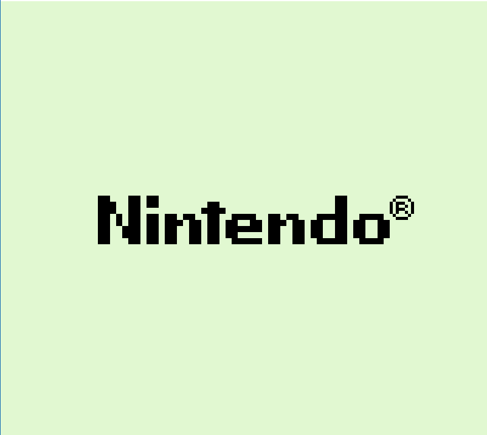
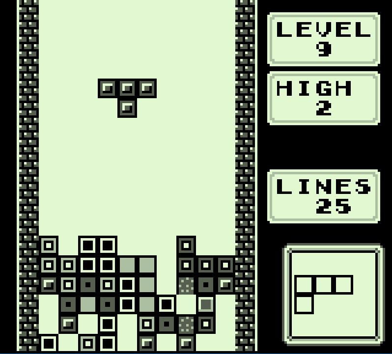
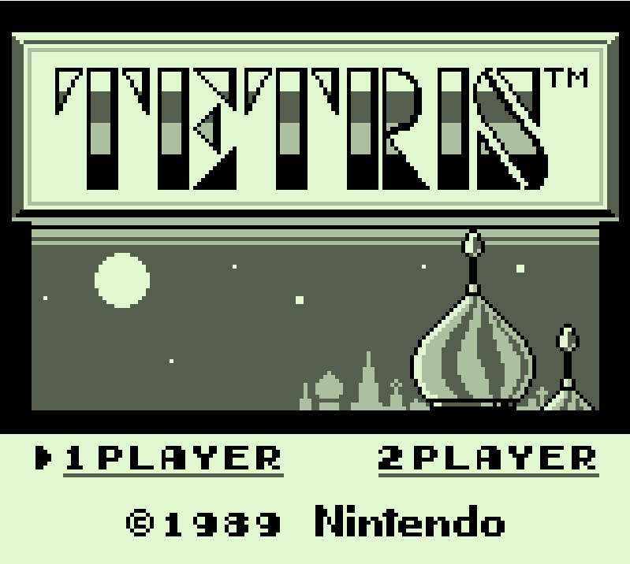
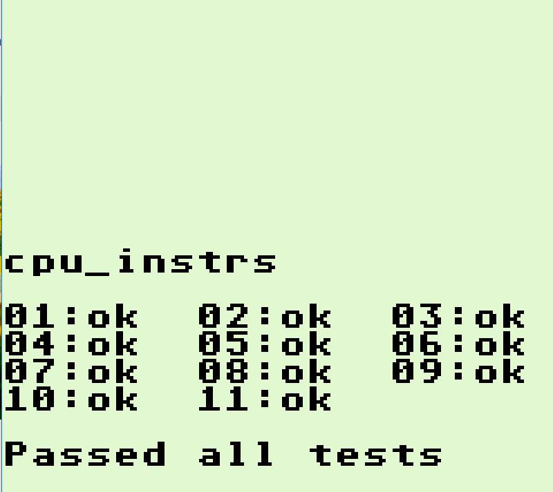

# Castor

Castor is a Gameboy interpreter written using C# and Monogame. The primary purpose of this project is to learn about emulator systems and low-level operations.

# Passing Tests

* Blargg's cpu_instrs
    * [x] 01 - special
    * [x] 02 - interrupts
    * [x] 03 - op sp,hl
    * [x] 04 - op r,imm
    * [x] 05 - op rp
    * [x] 06 - ld r,r
    * [x] 07 - jr,jp,call,ret,rst
    * [x] 08 - misc instrs
    * [x] 09 - op r,r
    * [x] 10 - bit ops
    * [x] 11 - op a,(hl)

* Blargg's dmg_sound [ ]

* Blargg's instr_timing [ ]

* Blargg's interrupt_time [ ]

* Blargg's mem_timing [ ]

* Blargg's mem_timing-2 [ ]

* Blargg's oam_bug [ ]

* Blargg's halt_bug [ ]

# Screenshot(s)

&nbsp;&nbsp;
&nbsp;&nbsp;
&nbsp;&nbsp;
&nbsp;&nbsp;

# Resources used:
* [The Ultimate Game Boy Talk](https://www.youtube.com/watch?v=HyzD8pNlpwI&t=2247s) - A talk attempting to communicate "everything about the Game Boy".
* [Gameboy Development Wiki](http://gbdev.gg8.se/wiki/articles/Main_Page) - A wiki containing technical documents, emulators, debuggers, and other tools that have to do with gameboy development.
* [Instruction Manual](https://rednex.github.io/rgbds/gbz80.7.html) - An online instruction manual on how each instruction should be implemented.
* [GBZ80 Decoding Manual](References/decoding_gz80.html) - A manual on how to algorithmically decode gameboy instructions as opposed to writing one huge switch-case statement for over 500 instructions.
* [Emulation accuracy](https://github.com/Gekkio/mooneye-gb/blob/master/docs/accuracy.markdown) - Documentation talking about questions about certain ambiguities of the gameboy.
